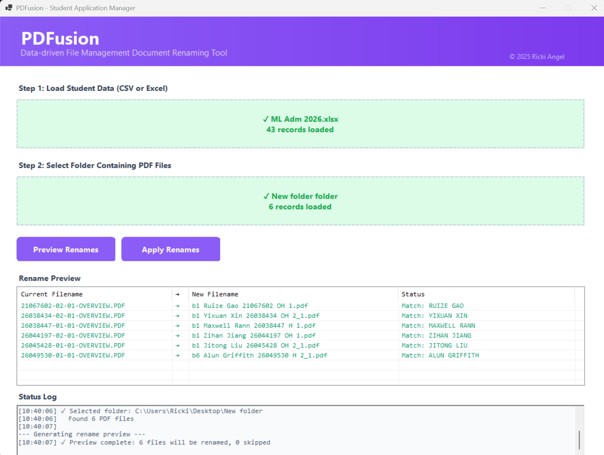

# PDFusion

**Data-driven document reorganisation tool**

A professional Windows desktop application for batch renaming student PDF application forms using CSV or Excel data. Built for admissions offices and educational institutions.



---

## Features

- Smart data loading from CSV or Excel files
- Batch process hundreds of PDFs in seconds
- Preview all changes before applying
- Renamed files saved to separate subfolder
- Undo support for last operation
- Modern Windows Forms interface
- Automatic proper case formatting and status codes

--- 

## Use Case

Designed for office administrators who need to:
- Organize large batches of student application PDFs
- Rename files based on spreadsheet data
- Maintain consistent file naming conventions
- Process applications efficiently

---

## How It Works

### Input Format

**PDF Files:**
```
26034824-01-01-OVERVIEW.PDF
26043635-02-01-OVERVIEW.PDF
26049530-01-01-OVERVIEW.PDF
```

**CSV/Excel Data:**

Required columns:
- `StudentNo` - Student number (matches PDF filename prefix)
- `Batch` - Batch identifier (e.g., "Batch 1", "Batch 2")
- `Forename` - Student's first name
- `Surname` - Student's last name
- `FeeStatus` - Fee classification (must contain "Home" or "Overseas")
- `UKGrade` - UK grade classification (e.g., "2.1", "1", "2.2", "3")

### Output Format

```
b1 John Smith 26049530 H 2_1.pdf
b1 Jane Doe 26038447 H 1.pdf
b1 Alex Johnson 26045428 OH 2_1.pdf
```

**Format breakdown:**
- `b1` - Batch number
- `John Smith` - Proper case name (converted from ALL CAPS)
- `26049530` - Student number
- `H` - Home fee status (`OH` = Overseas)
- `2_1` - UK grade classification

---

## Quick Start

### Usage

1. Launch `PDFusion.exe`
2. **Step 1:** Click or drag your CSV/Excel file with student data
3. **Step 2:** Choose the folder containing PDF files to rename
4. Click **Preview Renames** to see all proposed changes
5. Click **Apply Renames** to process files
6. Renamed files appear in the "Renamed" subfolder

Original PDF files remain untouched in the source folder.

---

## Installation

### Option A: Download Release (Recommended)
1. Download `PDFusion.exe` from the Releases page
2. Place it anywhere on your PC
3. Double-click to run (no installation required)

### Option B: Build from Source
1. Clone this repository
2. Open PowerShell in project folder
3. Run: `.\goDeploy.ps1`
4. Find `PDFusion.exe` on your Desktop

---

## System Requirements

- **OS:** Windows 10/11 (64-bit)
- **Runtime:** .NET 9.0 (included in self-contained builds)
- **Memory:** Minimum 100MB RAM
- **Storage:** 10MB disk space

---

## Project Structure

```
PDFusion/
├── readme_images/
│   └── screenshot1.png      # Application screenshot
├── data/                     # Sample data folder
├── MainForm.cs              # Main application logic
├── UIComponents.cs          # Custom UI controls
├── Program.cs               # Application entry point
├── PDFusion.csproj          # Project configuration
├── goDeploy.ps1             # Build & deployment script
└── README.md                # This file
```

---

## Smart Features

### Automatic Name Formatting
Converts names from ALL CAPS to proper case:
- `JOHN SMITH` → `John Smith`
- `MARIA GARCIA` → `Maria Garcia`
- `DAVID CHEN` → `David Chen`

### Fee Status Codes
- `HOME` or `HOME (PROVISIONAL)` → `H`
- `OVERSEAS` or `OVERSEAS STUDENTS` → `OH`

### UK Grade Formatting
- `2.1` or `2:1` → `2_1`
- `First Class` or `1st` → `1`
- `2.2` or `2:2` → `2_2`
- `3rd` or `3.0` → `3`

### Safety Features
- Original PDFs never modified
- Renamed files saved to separate folder
- Preview all changes before applying
- Undo last batch operation
- Detailed status logging
- Handles duplicate filenames gracefully

---

## Troubleshooting

### Common Issues

**"Could not find StudentNo column"**
- Ensure your CSV/Excel has a column named exactly `StudentNo`
- Check for extra spaces or special characters in header names

**"Student XXXXXXXX not found in data"**
- The PDF's student number doesn't exist in your data file
- Verify student numbers match between PDFs and spreadsheet

**"Could not extract student number"**
- PDF filename doesn't match expected format
- Required format: `XXXXXXXX-XX-XX-OVERVIEW.PDF` (8 digits at start)

**"Target already exists"**
- A file with the new name already exists in the Renamed folder
- Check for duplicate student records in your data

---

## Building from Source

### Prerequisites
- .NET 9.0 SDK or later
- Windows OS

### Build Instructions

```powershell
# Clone repository
git clone https://github.com/yourusername/pdfusion.git
cd pdfusion

# Option 1: Use deployment script (recommended)
.\goDeploy.ps1

# Option 2: Manual build
dotnet restore PDFusion.csproj
dotnet build PDFusion.csproj -c Release
dotnet publish PDFusion.csproj -c Release -r win-x64 --self-contained
```

Executable location:
```
bin\Release\net9.0-windows\win-x64\publish\PDFusion.exe
```

---

## License

© 2025 Ricki Angel

Free to use for educational and personal purposes.

---

## Contributing

Contributions are welcome. Please submit a Pull Request.

---

## Acknowledgments

**Built with:**
- .NET 9.0 Windows Forms - UI Framework
- EPPlus 7.5.2 - Excel file processing
- C# - Programming language

---

## Support

For issues, questions, or feature requests, please open an issue on GitHub.